# JasinaHub — Voice Data Collection Platform

A voice data collection platform designed for gathering and managing audio recordings in low-resource African languages at scale. Built with a focus on user experience, accessibility, and robust data management.


## Table of Contents

- [Objective](#objective)
- [Functionalities](#functionalities)
- [Tech Stack](#tech-stack)
- [Architecture](#architecture)
- [Diagrams](#diagrams)
  - [High-level architecture](#high-level-architecture)
  - [Structural and data diagrams](#structural-and-data-diagrams)
  - [Behavioral and flow diagrams](#behavioral-and-flow-diagrams)
  - [User-centric diagrams](#user-centric-diagrams)
- [Getting Started](#getting-started)
- [Project Structure](#project-structure)
- [Database Schema](#database-schema)
- [Security](#security)
- [Contributing](#contributing)

## Objective

JasinaHub aims to curate structured, high-quality voice datasets in low-resource African languages for developing Automatic Speech Recognition (ASR) systems. The platform enables community-driven data collection by providing an accessible web interface where volunteers can record spoken responses to health-related prompts in their native languages. Approved transcribers then convert these recordings into text, producing paired audio–transcription datasets suitable for training and evaluating ASR models.

The key goals of the project are:

1. **Scalable voice data collection** — Enable large numbers of volunteers to contribute voice recordings through a simple, mobile-friendly interface.
2. **Community-driven transcription** — Allow approved transcribers to convert audio recordings into text, with quality controls and guidelines for handling dialectal variations and borrowed words.
3. **Dataset curation** — Pair audio recordings with verified transcriptions to produce structured datasets ready for ASR model training.
4. **Quality assurance** — Provide administrators with tools to review, accept, or reject recordings and transcriptions to maintain dataset quality.
5. **Accessibility and inclusivity** — Deliver a mobile-first, offline-resilient experience so that users in areas with limited connectivity can still participate.

## Functionalities

### Voice Recording Module

- **Structured question navigation** — Volunteers respond to categorised health-related prompts organised by topic.
- **In-browser audio capture** — Records audio using the MediaRecorder API in WebM/Opus format directly in the browser.
- **Real-time waveform visualisation** — Displays a live waveform during recording via the `AudioWaveform` component.
- **Cloud upload** — Uploads completed recordings to cloud storage via a serverless edge function.
- **Progress tracking** — Tracks per-category completion so volunteers can resume across sessions, with visual indicators on the dashboard (`SegmentedProgress` component).
- **Consent management** — Records explicit voice recording consent with timestamps before any recording begins (GDPR-compliant).

### Transcription Module

- **Atomic transcription assignment** — Uses a PostgreSQL function (`claim_random_transcription`) with time-limited locks to randomly assign untranscribed recordings to available transcribers, preventing duplicate work.
- **Audio playback** — Transcribers listen to assigned recordings with inline audio controls.
- **Text transcription** — Transcribers type the spoken content in the original language.
- **Edit tracking** — Records edit counts and submission timestamps for each transcription.
- **Transcription guidelines** — Provides comprehensive reference guidelines covering borrowed words, punctuation, and dialectal variations via the `TranscriptionGuidelinesReference` panel.
- **Lock expiry** — Automatically releases assignments via `release_transcription_lock` if a transcriber does not complete within the time limit.

### Administration & Quality Assurance Module

- **Dashboard analytics** — Real-time statistics on total recordings, transcriptions, active users, and per-question response distributions.
- **User management** — Verify user accounts, approve transcribers, and assign roles (admin/user) via dedicated tables.
- **Response review** — Accept or reject submitted recordings with three-state status transitions (pending → accepted / rejected).
- **Transcription oversight** — Monitor transcription progress and quality.
- **Dataset export** — Export paired audio–transcription records as ZIP archives for downstream ASR model training.
- **Active user monitoring** — Real-time presence tracking showing currently online users via the `PresenceTracker` component and `usePresenceTracking` hook.

### User Dashboard

- **Category overview** — Displays all question categories with completion progress per category.
- **My Responses** — View and listen to previously submitted recordings.
- **My Transcriptions** — View completed transcriptions with playback of the associated audio.
- **Profile management** — Update personal details and demographic information.

### Mobile-First Design & Offline Resilience

- **Progressive Web App (PWA)** — Installable on mobile devices with service worker support.
- **Responsive layouts** — Mobile-first design with touch-optimised controls.
- **Haptic feedback** — Native-like vibration feedback on supported devices (`useHapticFeedback` hook).
- **Swipe gestures** — Navigate between questions with swipe gestures (`useSwipeGesture` hook).
- **Pull-to-refresh** — Native-like refresh gesture for mobile users (`usePullToRefresh` hook).
- **Offline recovery** — Audio recordings are persisted to IndexedDB/localStorage before upload. If an upload fails, the `RecoveryDialog` component detects orphaned recordings on the next visit and prompts the user to retry.
- **Network status indicator** — The `OfflineIndicator` component provides real-time connectivity feedback.

### Activity Tracking & Monitoring

- **User activity logging** — Logs page visits, recording submissions, and transcription completions to the `user_activity_logs` table via the `useActivityTracker` hook.
- **Real-time presence** — Tracks concurrent platform usage for administrator visibility.
- **Analytics charts** — Interactive visualisations (built with Recharts) showing recording trends, transcription progress, and user engagement metrics.

## Tech Stack

### Frontend

| Technology | Purpose |
|------------|---------|
| **React 18** | UI library with concurrent features |
| **TypeScript** | Static type checking and enhanced DX |
| **Vite** | Next-generation build tool with HMR |
| **Tailwind CSS** | Utility-first CSS framework |
| **shadcn/ui** | Accessible, customizable component library |
| **React Router v6** | Client-side routing with nested routes |
| **TanStack Query** | Server state management and caching |
| **Recharts** | Charting library for admin analytics |
| **Lucide React** | Modern icon library |

### Backend (Lovable Cloud / Supabase)

| Technology | Purpose |
|------------|---------|
| **PostgreSQL** | Primary database with JSONB support |
| **Row Level Security** | Fine-grained access control at database level |
| **Supabase Auth** | Authentication with email/password |
| **Supabase Realtime** | WebSocket-based presence and live queries |
| **Edge Functions** | Deno-based serverless functions |
| **Storage Buckets** | Secure file storage with access policies |

## Architecture

JasinaHub follows a three-tier architecture: a React single-page application on the client, the Supabase client SDK and PostgREST/Realtime APIs in the middle, and PostgreSQL, Edge Functions, and Storage Buckets on the backend. See the [Container diagram](#container-diagram) below for a detailed view.

### Data Flow

1. **Authentication** — Users authenticate via email/password.
2. **Consent** — Volunteers provide explicit recording consent before proceeding.
3. **Recording** — Audio captured via MediaRecorder API, persisted locally, then uploaded to cloud storage.
4. **Transcription** — Approved transcribers claim recordings, listen, and provide text transcriptions.
5. **Quality Control** — Administrators review and accept/reject recordings and transcriptions.
6. **Dataset Export** — Paired audio–transcription data exported for ASR model training.

## Diagrams

This section provides visual documentation of JasinaHub's architecture, data model, behavior, and user flows. All diagrams are written in Mermaid and render natively on GitHub.

<p align="center">
  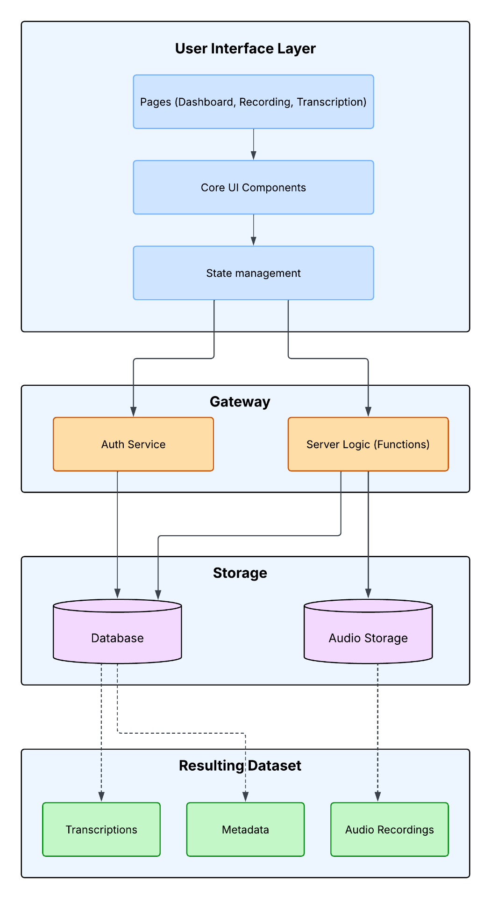
</p>


### High-level architecture

#### High-level system architecture

End-to-end view of JasinaHub — from end users (Volunteers, Transcribers, Admins), through the React PWA frontend and Lovable Cloud backend (Auth, PostgreSQL with RLS, Object Storage, Edge Functions, Realtime), down to the curated ASR dataset that feeds downstream speech model training (wav2vec 2.0, Whisper, MMS).

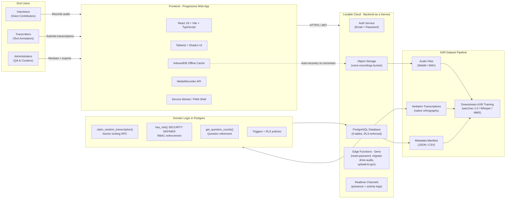

#### System context diagram

Shows JasinaHub as a single system in its environment, the people who interact with it, and the external systems it depends on or produces.

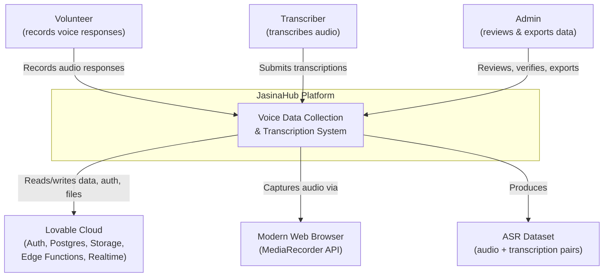

#### Container diagram

Zooms into the JasinaHub system to show the major deployable units (containers) and how they communicate.

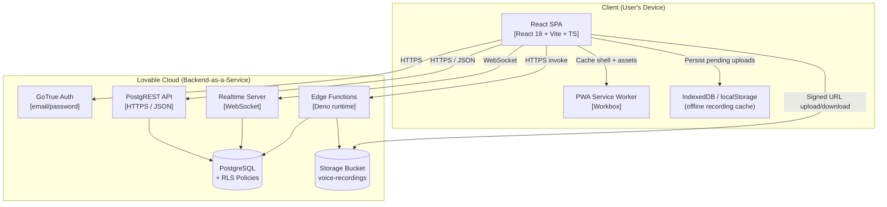

### Structural and data diagrams

#### Entity-relationship diagram

The full relational model backing the platform: 9 tables covering user identity, content, recordings, transcriptions, locks, roles, progress, and audit logs.

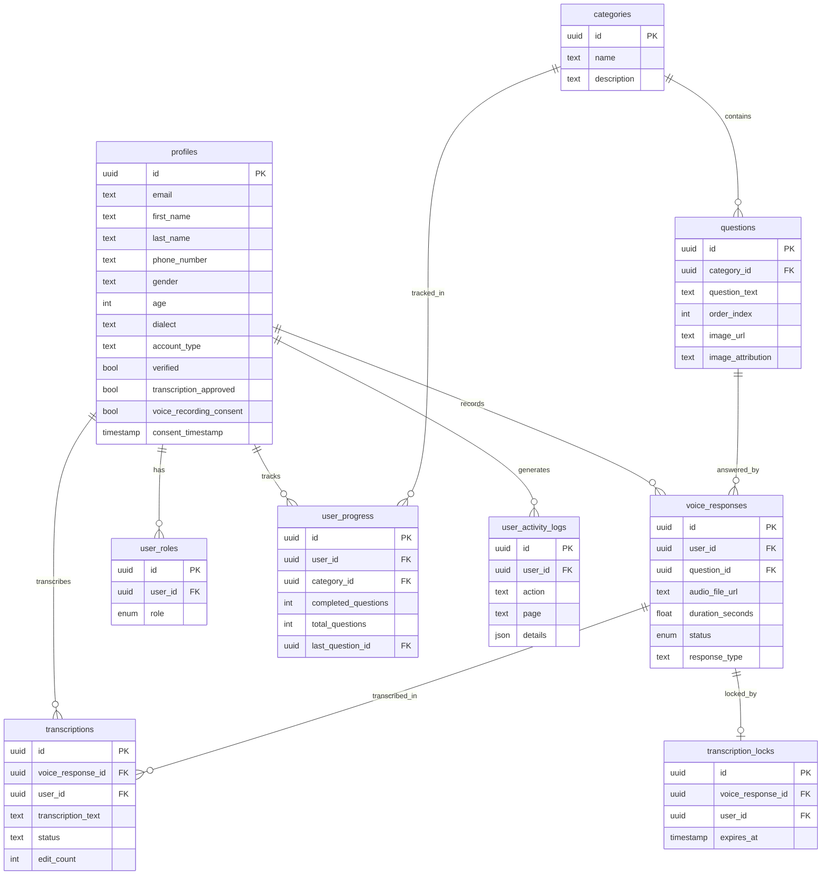

#### UML component diagram

Layered view of the codebase: page components depend on core feature modules, which rely on client infrastructure, all backed by Lovable Cloud services that produce the ASR dataset.

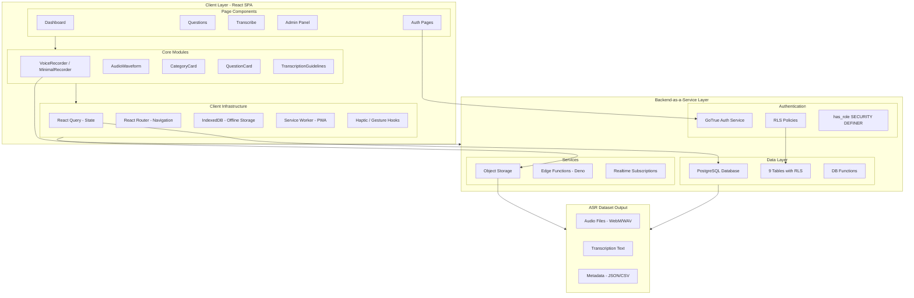

### Behavioral and flow diagrams

#### Sequence diagram — Voice recording pipeline

End-to-end interaction when a volunteer records and submits a response, including offline backup to IndexedDB.

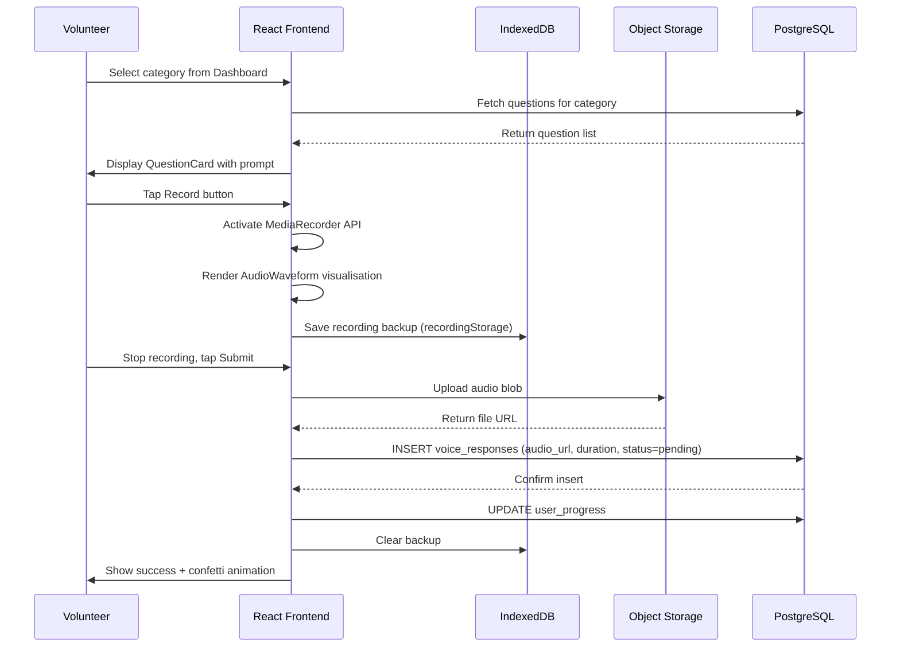

#### Sequence diagram — Atomic transcription claim

How a transcriber is assigned a unique recording without race conditions, using time-limited database locks.

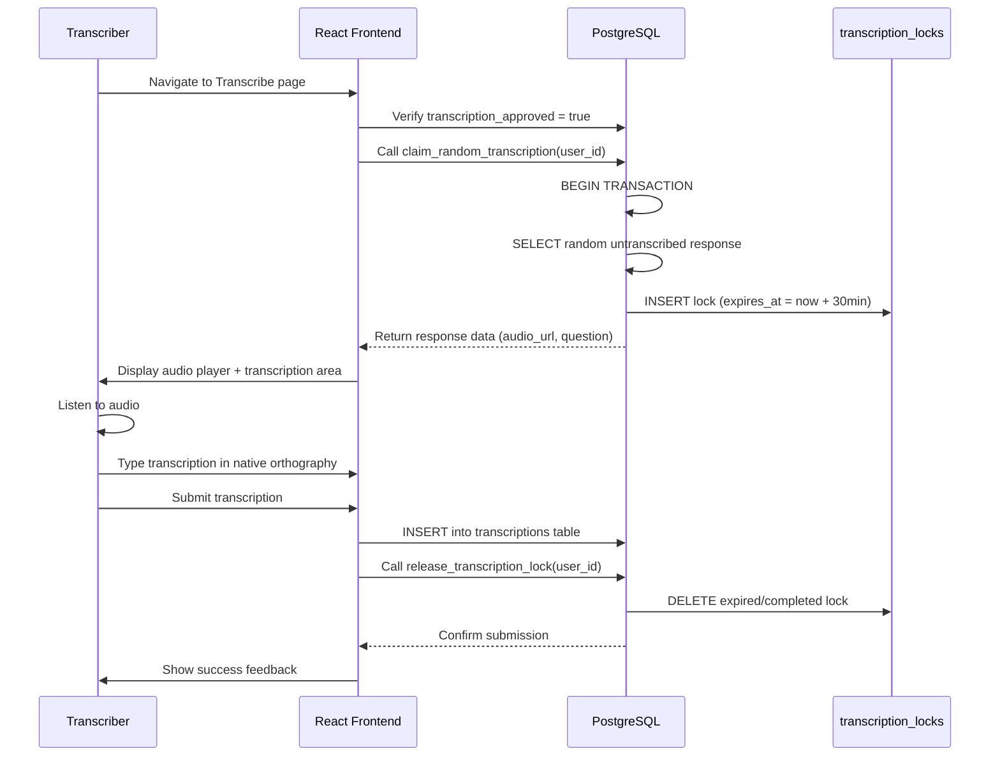

#### Flowchart

The full journey of a single piece of data, from a volunteer's signup to its appearance in the exported ASR dataset.

<p align="center">
  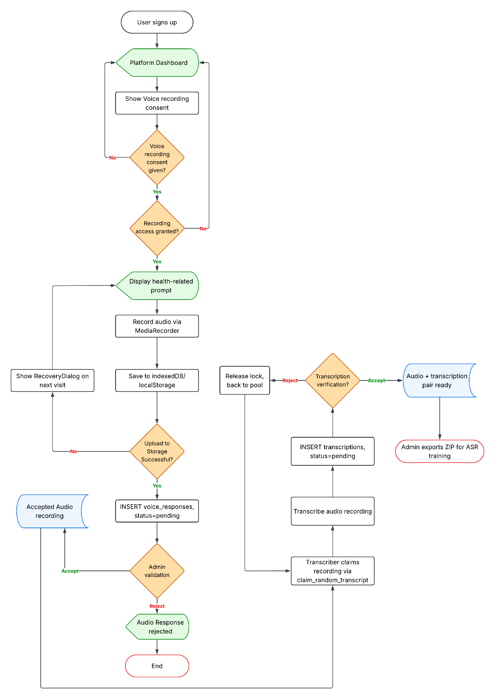
</p>

### User-centric diagrams
#### Volunteer

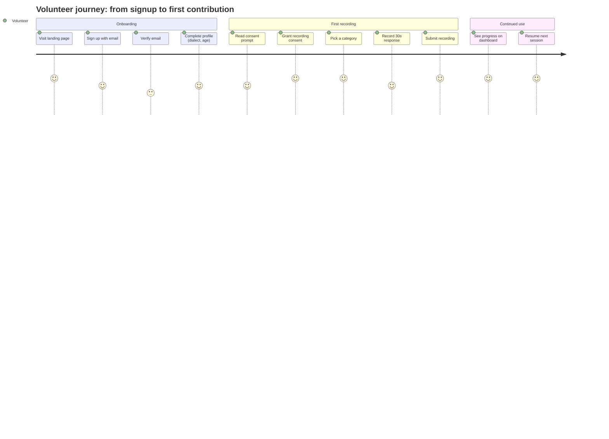

#### Transcriber

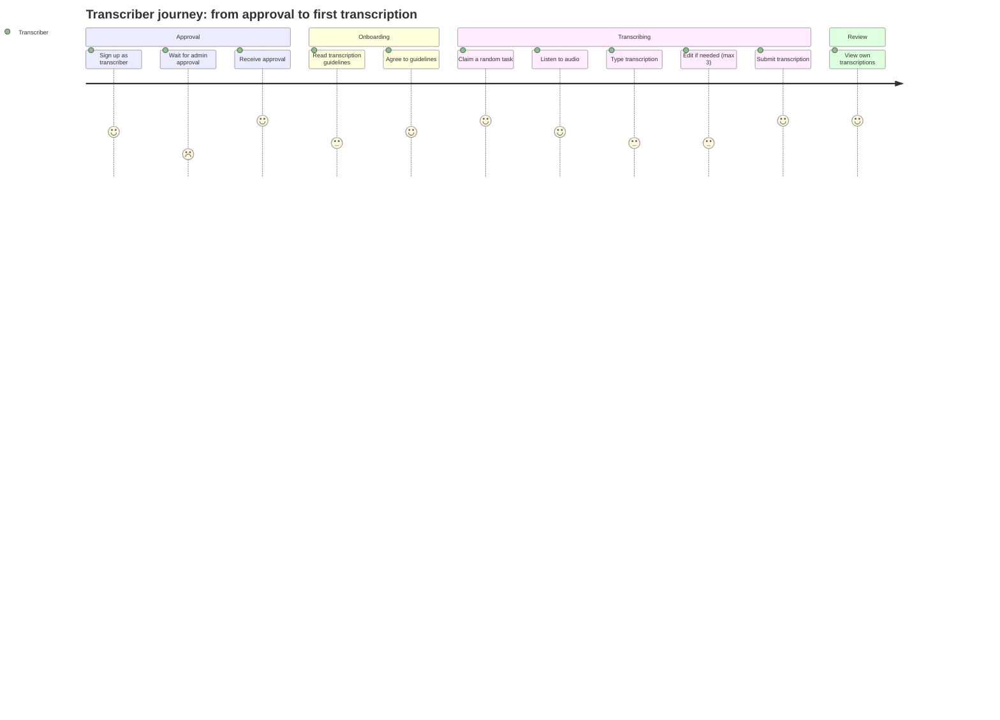

#### Admin

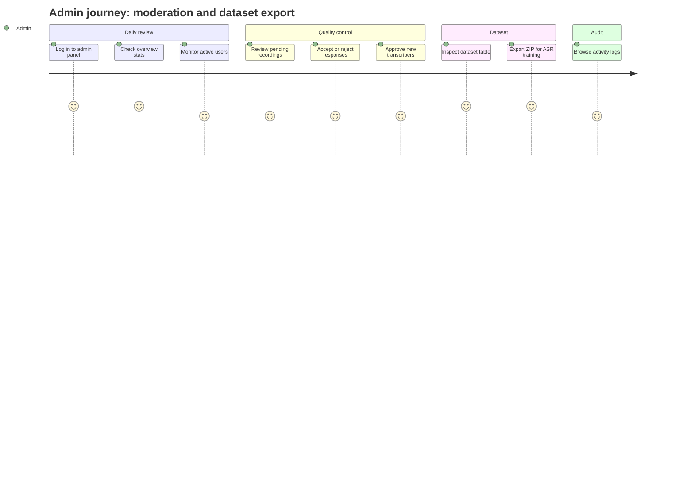

## Getting Started

### Prerequisites

- Node.js 18+ or Bun
- Git

### Installation

```bash
# Clone the repository
git clone <repository-url>
cd <project-directory>

# Install dependencies
npm install

# Start development server
npm run dev
```

The app will be available at `http://localhost:8080`

### Environment Variables

Environment variables are automatically managed by Lovable Cloud. For local dev, copy `.env.example` to `.env` and fill in the values:

| Variable | Description |
|----------|-------------|
| `VITE_SUPABASE_URL` | Supabase project URL |
| `VITE_SUPABASE_PUBLISHABLE_KEY` | Supabase anon/public key |
| `VITE_SUPABASE_PROJECT_ID` | Project identifier |

### More docs

- [Quick start](QUICKSTART.md) — 5-minute setup
- [Architecture](docs/ARCHITECTURE.md) — layers, data flow, state
- [API reference](docs/API.md) — tables, RPCs, edge functions, storage
- [Database & migrations](docs/DATABASE.md) — schema, seed, admin promotion
- [Local Supabase setup](docs/LOCAL_SUPABASE.md) — full offline stack
- [Testing](docs/TESTING.md) — in-app test harness
- [Deployment](docs/DEPLOYMENT.md) — Lovable / Vercel / Netlify
- [Troubleshooting](docs/TROUBLESHOOTING.md) — common errors
- [Demo accounts](docs/DEMO.md)
- [Contributing](CONTRIBUTING.md)

## Project Structure

```
src/
├── components/
│   ├── Admin/           # Admin panel components
│   ├── Auth/            # Authentication guards and layouts
│   ├── Dashboard/       # User dashboard components
│   ├── Questions/       # Question display and recording
│   ├── Transcription/   # Transcription guidelines
│   ├── VoiceRecording/  # Audio recording components
│   └── ui/              # shadcn/ui components
├── hooks/
│   ├── useActivityTracker.ts    # User activity logging
│   ├── usePresenceTracking.ts   # Real-time presence
│   ├── useHapticFeedback.ts     # Mobile haptics
│   ├── usePullToRefresh.ts      # Pull-to-refresh gesture
│   └── useSwipeGesture.ts       # Touch gestures
├── integrations/
│   └── supabase/        # Auto-generated client and types
├── pages/               # Route components
├── services/            # External service integrations
├── utils/               # Utility functions
└── lib/                 # Shared utilities

supabase/
├── functions/           # Edge functions
│   ├── reset-password/  # Password reset handler
│   └── upload-to-gcs/   # File upload handler
├── migrations/          # Database migrations
└── config.toml          # Supabase configuration
```

## Database Schema

### Core Tables

| Table | Description |
|-------|-------------|
| `profiles` | User profile data with demographic metadata and verification status |
| `categories` | Thematic groupings for health-related questions |
| `questions` | Individual prompts within categories |
| `voice_responses` | Audio recordings with three-state review status |
| `transcriptions` | Text transcriptions of voice responses |
| `transcription_locks` | Atomic locking mechanism for transcription assignment |
| `user_progress` | Per-category completion tracking |
| `user_roles` | Role assignments (admin/user) |
| `user_activity_logs` | Audit trail of user actions |

### Key Relationships

See the full [Entity-relationship diagram](#entity-relationship-diagram) in the Diagrams section for attributes and cardinality.

## Security

### Authentication

- Email/password authentication with email verification
- Password strength validation on signup
- Password reset via Edge Function with secure token handling

### Authorization

- **Row Level Security (RLS)** — All tables protected with policies
- **Role-based Access** — Admin role checked via `has_role()` security definer function
- **User Isolation** — Users can only access their own data

### Data Protection

- Audio files stored in secure buckets with signed URLs
- Consent timestamp recorded before any recording
- Activity logging for audit compliance

## Contributing

1. Fork the repository
2. Create a feature branch (`git checkout -b feature/amazing-feature`)
3. Commit your changes (`git commit -m 'Add amazing feature'`)
4. Push to the branch (`git push origin feature/amazing-feature`)
5. Open a Pull Request

### Code Standards

- TypeScript strict mode enabled
- ESLint configuration for consistent code style
- Semantic component naming
- Comprehensive type definitions

---

[Live preview](https://www.jasinahub.vercel.app)

Centre for Data Science and Artificial Intelligence (DSAIL) ©2026
